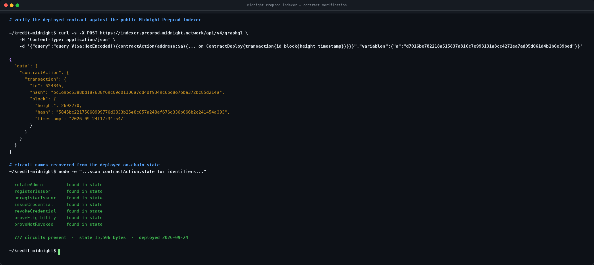
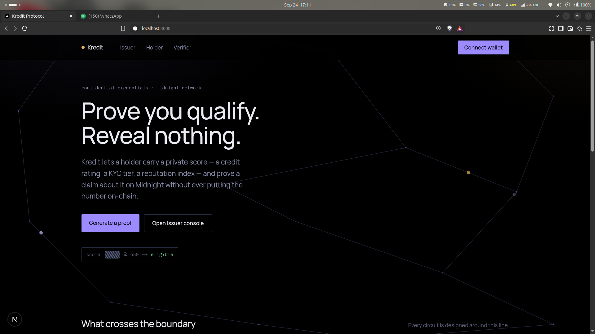
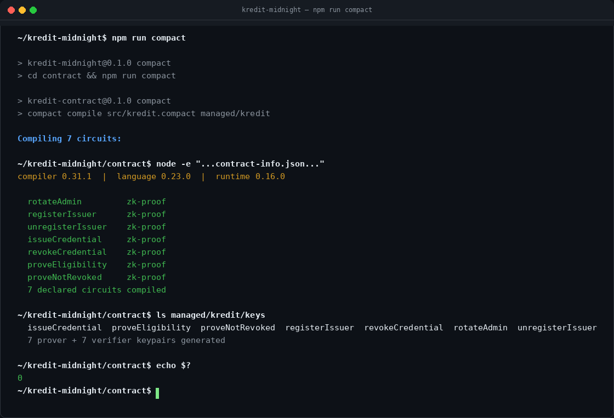
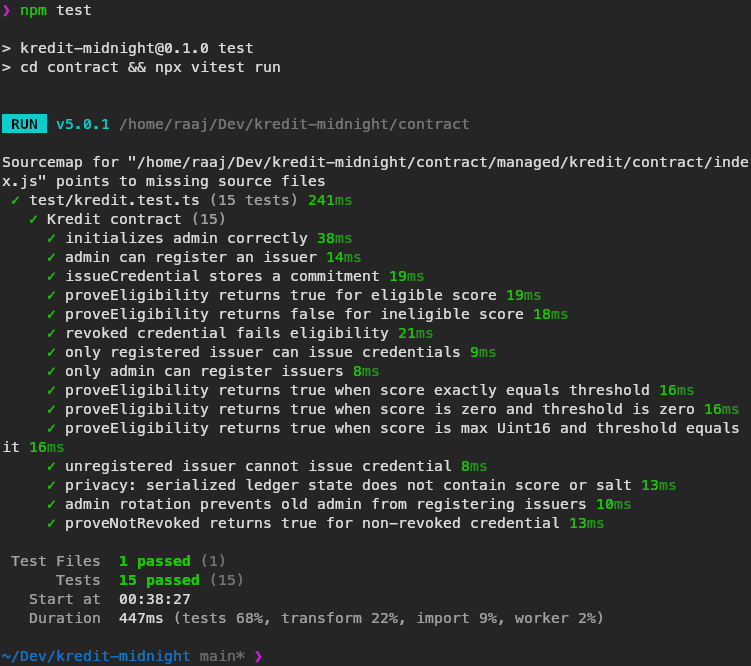

# Kredit Protocol

**Confidential Credential & Eligibility Protocol on Midnight Network**

> Prove you qualify for a loan — without revealing your credit score.

[](https://github.com/rue19/kredit-midnight/actions/workflows/ci.yml)
[](LICENSE)

---

## Deployed Contract

| Field | Value |
|---|---|
| **Contract ID** | `d7016be782218a515837a816c7e993131a8cc4272ea7ad05d061d4b2b6e39bed` |
| **Network** | Midnight Preprod |
| **Name** | `kredit` |
| **Circuits** | `rotateAdmin`, `registerIssuer`, `unregisterIssuer`, `issueCredential`, `revokeCredential`, `proveEligibility`, `proveNotRevoked` |
| **Runtime** | 0.16.0 |
| **Contract Language** | Compact 0.23 |
| **Deploy transaction** | id `624845` — hash `ec1e9bc5388bd187638f69c09d01106a7dd4df9349c6be8e7eba372bc85d214a` |
| **Deploy block** | `2692270` — `5845bc22175868999776d3833b25e8c857a248af676d336b066b2c241454a393` — 2026-09-24 17:34:54 UTC |

The contract is compiled from `contract/src/kredit.compact` and deployed on Midnight Preprod. The same contract ID is used by every page of the frontend (`issuer`, `user`, `verify`); the deployed address is remembered by the Issuer Console and reused by the User and Verifier views.

### Verify it yourself

Preprod has no public block-explorer page for contract state, but the public
indexer is open — anyone can confirm the contract exists on-chain without
trusting this README:

```bash
ADDR=d7016be782218a515837a816c7e993131a8cc4272ea7ad05d061d4b2b6e39bed

curl -s -X POST https://indexer.preprod.midnight.network/api/v4/graphql \
  -H 'Content-Type: application/json' \
  -d "{\"query\":\"query V(\$a:HexEncoded!){contractAction(address:\$a){... on ContractDeploy{state transaction{id hash block{height timestamp}}}}}\",\"variables\":{\"a\":\"$ADDR\"}}"
```

This returns the deploy transaction and the contract's on-chain state. All
seven circuit names (`rotateAdmin` … `proveNotRevoked`) are present in that
state, so the address is the Kredit contract and not an empty or unrelated
deployment:



---

## Live Demo & Video

**Live Demo:** [https://kredit-midnight-frontend.vercel.app](https://kredit-midnight-frontend.vercel.app)
[](https://kredit-midnight-frontend.vercel.app)

**Walkthrough Video:**

[](https://youtu.be/u_vi6gyc3AA)

> Click the thumbnail above (or [watch on YouTube](https://youtu.be/u_vi6gyc3AA)) for a full walkthrough: wallet setup, contract deployment, credential issuance, and a zero-knowledge eligibility proof.

**Screenshots** (captured from the live deployment above):

| Landing page | Issuer Console |
|---|---|
|  |  |

---

## What Is Kredit?

Kredit lets a user hold a **private numeric credential** — a credit score, KYC tier, or reputation index — and **prove a claim about it** ("I qualify," "I'm above threshold X," "my credential is valid and unrevoked") **without ever putting the underlying value on-chain.**

An issuer (e.g., a bank) issues a credential commitment on-chain. The user holds their raw score locally in their browser. When a verifier (e.g., a lender) needs to check eligibility, the user generates a ZK proof that their score meets the threshold. The verifier learns only the **boolean result** — never the actual score.

---

## Architecture

```
┌─────────────────────────────────────────────────────────────────┐
│                      FRONTEND (Next.js)                          │
│  Issuer Console          User View           Verifier View       │
│  - deploy contract       - generate keys     - request proof     │
│  - register issuer       - enter score       - see pass/fail     │
│  - issue/revoke          - generate proof                        │
└──────────────────────┬──────────────┬────────────────────────────┘
                       │              │
               Midnight.js SDK   DApp Connector
                       │              │
                       ▼              ▼
┌─────────────────────────────────────────────────────────────────┐
│                    LACE WALLET (Preprod)                         │
│    holds keys · signs txs · generates ZK proofs internally      │
└──────────────────────────────┬──────────────────────────────────┘
                               │
                               ▼
┌─────────────────────────────────────────────────────────────────┐
│                 MIDNIGHT NODE + INDEXER                           │
│          executes circuits, stores public ledger state            │
└─────────────────────────────────────────────────────────────────┘
```

### The Flow

1. **Deploy** — Admin deploys the Kredit contract on Midnight Preprod.
2. **Register Issuer** — Admin registers trusted issuers (banks, KYC providers).
3. **Issue Credential** — Issuer issues a credential commitment (`persistentCommit(score, salt)`). The raw score never touches the chain.
4. **User Holds Secrets** — The user's score, salt, and keys are stored locally in the browser.
5. **Generate Proof** — When a verifier requests a check, the user generates a ZK proof that `score >= threshold`. Only the boolean result is disclosed.
6. **Verify** — The verifier sees pass/fail and revocation status — never the actual score.

---

## Privacy Model

### What an Observer CAN Learn

| Observable | Description |
|---|---|
| Credential existence | Whether an address holds a commitment on-chain |
| Pass / fail | The boolean result of a threshold check |
| Revocation status | Whether a credential has been revoked |
| Issuer registry | Which addresses are registered as trusted issuers |

### What an Observer CANNOT Learn

| Protected | Description |
|---|---|
| Raw score | The actual numeric value behind the credential |
| Salt | The random 32-byte salt used in the commitment |
| Issuer key | The issuer's private signing material |
| Holder secret | The holder's domain-separated secret key |
| Admin secret | The admin's private key |

### Known Limitations

| Limitation | Impact |
|---|---|
| Holder linkability | Domain-separated keys allow linking multiple proof requests to the same holder |
| Threshold probing | Adversary can perform binary search to narrow the raw score |
| Issuer knows the raw score | When issuing a credential, the issuer observes the raw score |
| Client-side storage | `localStorage` stores secrets in plaintext — vulnerable to XSS |

---

## Contract Details

### Circuit Surface

| Circuit | Access | Description |
|---|---|---|
| `rotateAdmin(newAdmin)` | Admin | Transfer admin role |
| `registerIssuer(issuerId)` | Admin | Add trusted issuer |
| `unregisterIssuer(issuerId)` | Admin | Remove issuer |
| `issueCredential(subject)` | Issuer | Store credential commitment |
| `revokeCredential(subject)` | Issuer | Mark credential as revoked |
| `proveEligibility(threshold) → Bool` | Holder | Prove `score >= threshold` |
| `proveNotRevoked() → Bool` | Holder | Prove credential is not revoked |

`npm run compact` compiles all 7 circuits with the Compact 0.31.1 compiler, generating a prover/verifier keypair for each:



### Public Ledger State

| Field | Type | Description |
|---|---|---|
| `contractAdmin` | `Bytes<32>` | Domain-separated admin public key |
| `credentials` | `Map<Bytes<32>, Bytes<32>>` | Holder key → commitment hash |
| `issuerRegistry` | `Map<Bytes<32>, Boolean>` | Issuer pk → registered |
| `revoked` | `Set<Bytes<32>>` | Revoked holder keys |

### Private Witnesses (never on-chain)

| Witness | Type |
|---|---|
| `adminSecret()` | `Bytes<32>` |
| `issuerSecret()` | `Bytes<32>` |
| `credentialScore()` | `Uint<16>` |
| `credentialSalt()` | `Bytes<32>` |
| `holderSecret()` | `Bytes<32>` |

---

## Tech Stack

| Layer | Technology |
|---|---|
| Contract Language | Compact 0.23 |
| Compiler | `compact` 0.31.1 |
| Compact JS | 2.5.1 |
| Compact Runtime | 0.16.0 |
| Midnight.js | 4.1.1 |
| DApp Connector API | 4.0.1 |
| Wallet | Lace (Midnight Preprod build, Chrome extension) |
| SDK | `@midnight-ntwrk/midnight-js-*` |
| Frontend | Next.js 16 + React 19 + TypeScript + Tailwind CSS 4 |
| Tests | Vitest + `@midnight-ntwrk/compact-runtime` simulator |
| CI/CD | GitHub Actions |
| Hosting | Vercel |

---

## Prerequisites

- **Node.js** v22+
- **Docker** (running, for proof server)
- **Compact toolchain** (`compact update 0.31.1`)
- **Lace wallet** (Midnight Preprod build, Chrome extension) with Developer Mode enabled

---

## Quick Start

```bash
# Clone
git clone https://github.com/rue19/kredit-midnight.git
cd kredit-midnight

# Install
npm install

# Compile the contract
npm run compact

# Run tests
npm test

# Start frontend
cd frontend && npx next dev --port 3000 --hostname 0.0.0.0
```

Open [http://localhost:3000](http://localhost:3000) in your browser.

### Wallet Setup

1. Install the **Lace wallet** Chrome extension (Midnight Preprod build)
2. Enable **Developer Mode** in Lace wallet settings
3. Switch to the **Midnight Preprod** network
4. Ensure your wallet has shielded keys initialized

---

## Test Suite

15 tests covering the full lifecycle:

| # | Test | Category |
|---|---|---|
| 1 | Initializes admin correctly | Admin |
| 2 | Admin can register an issuer | Admin |
| 3 | IssueCredential stores a commitment | Issuer |
| 4 | ProveEligibility returns true for eligible score | Proof |
| 5 | ProveEligibility returns false for ineligible score | Proof |
| 6 | Revoked credential fails eligibility | Revocation |
| 7 | Only registered issuer can issue credentials | Access |
| 8 | Only admin can register issuers | Access |
| 9 | ProveEligibility returns true at exact threshold | Proof |
| 10 | ProveEligibility returns true for zero score/threshold | Edge |
| 11 | ProveEligibility returns true for max Uint16 | Edge |
| 12 | Unregistered issuer cannot issue credential | Access |
| 13 | Privacy: ledger state does not contain score or salt | Privacy |
| 14 | Admin rotation prevents old admin from registering issuers | Admin |
| 15 | ProveNotRevoked returns true for non-revoked credential | Revocation |

`npm test` runs the suite against the Compact runtime simulator:



---

## Folder Structure

```
kredit-midnight/
├── contract/
│   ├── src/
│   │   ├── kredit.compact              # Smart contract (7 circuits)
│   │   ├── witnesses.ts                # TypeScript witness implementations
│   │   └── index.ts                    # Package exports
│   ├── test/
│   │   └── kredit.test.ts              # Contract unit tests (15 tests)
│   ├── managed/kredit/                 # Compiled artifacts (keys, zkir, contract)
│   └── package.json
├── api/
│   └── src/index.ts                    # Shared types
├── frontend/
│   ├── app/
│   │   ├── page.tsx                    # Landing page with dithering shader
│   │   ├── issuer/page.tsx             # Issuer Console (deploy, register, issue, revoke)
│   │   ├── user/page.tsx               # User View (key generation, eligibility proof)
│   │   └── verify/page.tsx             # Verifier View
│   ├── components/
│   │   ├── ConnectWalletButton.tsx     # Wallet connect button
│   │   └── ui/dithering-shader.tsx     # WebGL animation
│   ├── lib/
│   │   ├── wallet.tsx                  # useWallet() hook (Lace DApp Connector)
│   │   ├── providers.ts                # Midnight SDK provider setup
│   │   └── prover.ts                   # Private state + proof builder
│   ├── public/
│   │   ├── keys/                       # compiled prover/verifier keys, copied from contract/managed
│   │   └── zkir/                       # compiled ZKIR circuits, copied from contract/managed
│   └── package.json
├── docs/
│   ├── architecture.md
│   ├── privacy-model.md
│   ├── toolchain.md                    # Version source of truth
│   ├── proposal.md                     # Level 3 proposal
│   ├── demo-script.md                  # 60-second walkthrough script
│   ├── SUBMISSION_CHECKLIST.md         # Requirement-by-requirement status
│   └── test-output.txt                 # Text copy of the last test run
├── screenshots/
│   ├── home.png                        # Landing page
│   ├── issuer.png                      # Issuer Console
│   ├── demo.png                        # Live demo capture
│   ├── tests-passing.png               # Terminal capture: 15/15 tests passing
│   ├── compile-output.png              # Terminal capture: 7 circuits compiled
│   └── contract-verified.png           # Terminal capture: Preprod indexer query
├── .github/workflows/ci.yml            # CI/CD pipeline
├── start-services.sh                   # Local dev startup script
├── .env.example
└── package.json
```

---

## Environment Variables

Copy `.env.example` to `frontend/.env.local`:

```bash
cp .env.example frontend/.env.local
```

| Variable | Default | Description |
|---|---|---|
| `PROOF_SERVER_URL` | `http://localhost:6300` | Midnight proof server URL, used only when the wallet connector doesn't expose `getProvingProvider` |
| `NEXT_PUBLIC_ZK_ARTIFACTS_URL` | _(empty = same origin)_ | Client-side ZK artifacts URL (served from `frontend/public`) |
| `NEXT_PUBLIC_CONTRACT_ADDRESS` | _(empty)_ | Address of the Kredit contract already deployed on Preprod. Without this set, a visitor who hasn't personally deployed a contract from the Issuer console (which stores the address in their own browser's `localStorage`) will see "No contract deployed" on the Verify/User pages. Deploy once via the Issuer console, copy the resulting address, and set this variable (locally in `.env.local`, and in Vercel's project settings for the live demo). |

---

## CI/CD

GitHub Actions runs on every push/PR to `main`:

1. Checkout code
2. Setup Node.js 22
3. Install Compact toolchain + dependencies
4. Compile contract (Compact → `contract/managed/`)
5. Build contract package (tsc → `contract/dist/`, which is what `api` resolves `kredit-contract` types through)
6. Typecheck `contract` and `api`
7. Privacy check — no `privateState` in API routes
8. Run test suite, upload output as an artifact
9. Build API and frontend

Step 5 must precede step 6: `api` depends on `kredit-contract` via
`file:../contract`, whose `package.json` points `types` at `dist/index.d.ts`.
Without `dist/` on disk, `tsc` fails with *"Cannot find module
'kredit-contract' or its corresponding type declarations."*

---

## Troubleshooting

### "No Midnight wallet detected"
- Install the Lace wallet Chrome extension (Midnight Preprod build)
- Enable **Developer Mode** in Lace wallet settings

### Connect wallet button (or anything else) does nothing when opened via a LAN address
- Next.js 16's dev server blocks cross-origin requests to dev-only assets (JS chunks, HMR) unless the origin is explicitly trusted. Running with `--hostname 0.0.0.0` does **not** by itself allow browsing from `http://<lan-ip>:3000` — the page never finishes hydrating, so no click handlers work at all, not just Connect wallet
- Fixed by `allowedDevOrigins` in `frontend/next.config.ts` (already covers common home LAN ranges; add your own subnet there if it's not `192.168.0.x`/`192.168.1.x`/`10.0.0.x`)
- After changing `next.config.ts`, restart the dev server

### "Network mismatch"
- Open Lace wallet → Settings → Network → Switch to **Midnight Preprod**

### "Remote API ... was shutdown: object can no longer be used"
- Chrome suspended the Lace extension's background service worker (Manifest V3 behavior after inactivity), which killed the page's connection channel to it
- **Reload the page** and connect again — this is a browser/extension quirk, not an app bug, and a fresh page load gets a live channel

### "shielded coin public key is not available"
- The wallet needs shielded keys initialized
- Check if the wallet has completed initial setup on Preprod

### Proof generation fails
- Proofs are generated locally by the connected wallet (Lace) — the wallet must have
  shielded keys initialized on the Midnight Preprod network

### Compact compilation fails
- Verify: `compact --version`
- Update: `compact update 0.31.1`

### Build errors
- This project uses Next.js 16 with breaking changes
- See `frontend/AGENTS.md` for important notes

---

## Submission

### Moonshots Level 3 — Confidential Credential & Eligibility Protocol

**Checklist:**

- [x] Compact contract with 7 circuits deployed on Preprod (runtime 0.16.0) — [verifiable on-chain](#deployed-contract)
- [x] 15 passing tests (Vitest + compact-runtime simulator) — [terminal capture](screenshots/tests-passing.png)
- [x] Successful compile listing all 7 circuits — [terminal capture](screenshots/compile-output.png)
- [x] Working frontend on Preprod (Next.js 16 + Lace wallet integration) — [live demo](https://kredit-midnight-frontend.vercel.app)
- [x] ZK proof generation for eligibility and revocation checks
- [x] Privacy model with selective disclosure, including known limitations
- [x] CI/CD pipeline green on `main` — [latest run](https://github.com/rue19/kredit-midnight/actions/runs/36176044750)
- [x] Demo walkthrough video — [watch on YouTube](https://youtu.be/u_vi6gyc3AA)
- [x] Documentation (README, architecture, privacy model, toolchain, proposal, demo script)

Requirement-by-requirement status, with the exact command or endpoint used to
verify each one, is in [`docs/SUBMISSION_CHECKLIST.md`](docs/SUBMISSION_CHECKLIST.md).

**Key SDK Fixes:**
- CompiledContract wrapper (`CompiledContract.make()` + `withWitnesses()`)
- Wallet proving provider (`getProvingProvider()` + `createProofProvider()`)
- Synchronous `getCoinPublicKey`/`getEncryptionPublicKey` per SDK requirements
- Transaction serialization for `balanceUnsealedTransaction()`
- `toBytes32()` padding for all `Bytes<32>` circuit arguments

---

## License

MIT