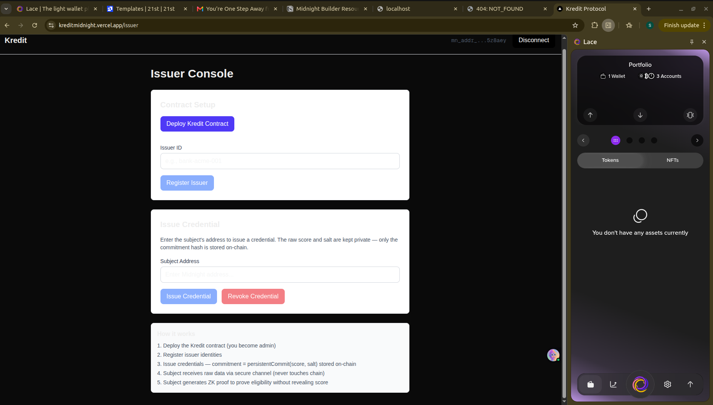
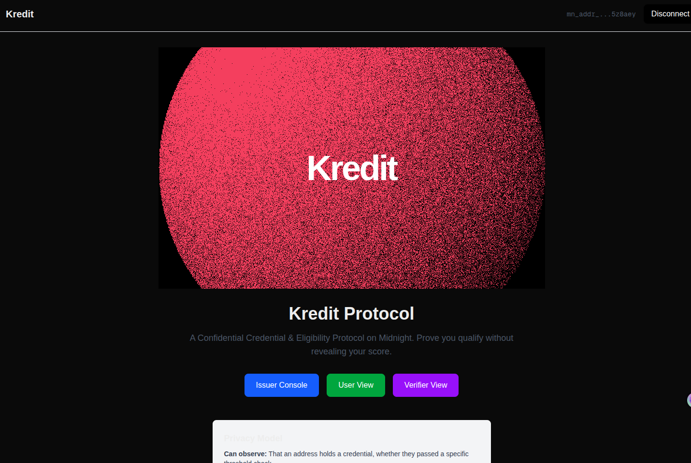

# Kredit Protocol

**A Confidential Credential & Eligibility Protocol on Midnight** — Prove you qualify without revealing your score.

[](https://github.com/rue19/kredit-midnight/actions/workflows/ci.yml)
[](LICENSE)

**Live Demo:** [https://kreditmidnight.vercel.app](https://kreditmidnight.vercel.app)

---

## What Is Kredit?

Kredit lets a user hold a **private numeric credential** — a credit score, KYC tier, or reputation index — and **prove a claim about it** ("I qualify," "I'm above threshold X," "my credential is valid and unrevoked") **without ever putting the underlying value on-chain.**

An issuer (e.g., a bank) issues a credential commitment on-chain. The user holds their raw score locally in their browser. When a verifier (e.g., a lender) needs to check eligibility, the user generates a ZK proof that their score meets the threshold. The verifier learns only the **boolean result** — never the actual score.

---

## How It Works

```
┌─────────────────────────────────────────────────────────────────┐
│                        FRONTEND (Next.js)                        │
│   Issuer Console          User View           Verifier View     │
│   - issue credential      - generate keys     - request proof   │
│   - revoke credential     - enter score       - see pass/fail   │
│                            - generate proof                      │
└──────────────────────┬──────────────┬──────────────┬────────────┘
                       │              │              │
               Midnight.js SDK   DApp Connector  Midnight.js SDK
                       │              │              │
                       ▼              ▼              ▼
┌─────────────────────────────────────────────────────────────────┐
│                       LACE WALLET (Preprod)                      │
│       holds keys  ·  signs txs  ·  talks to Proof Server        │
└──────────────────────┬──────────────────────────────┬───────────┘
                       │                              │
                       ▼                              ▼
┌─────────────────────────────┐    ┌──────────────────────────────┐
│       PROOF SERVER           │    │      MIDNIGHT NODE            │
│  (Docker, port 6300)         │    │   + INDEXER (Preprod RPC)    │
│  generates/verifies ZK       │◄──►│  executes circuits, stores   │
│  proofs                      │    │  public ledger state          │
└─────────────────────────────┘    └──────────────────────────────┘
                       │
                       ▼
┌─────────────────────────────────────────────────────────────────┐
│                    KREDIT COMPACT CONTRACT                        │
│                                                                   │
│  PUBLIC LEDGER STATE              PRIVATE WITNESS (never on-chain)│
│  ├─ credentials: Map<addr, Hash>  ├─ rawScore: Uint<16>          │
│  ├─ issuerRegistry: Map<addr, ?>  ├─ salt: Bytes<32>             │
│  ├─ revoked: Set<addr>            ├─ holderSecret: Bytes<32>     │
│  └─ contractAdmin: Bytes<32>      ├─ issuerSecret: Bytes<32>     │
│                                   └─ adminSecret: Bytes<32>      │
│                                                                   │
│  CIRCUITS                                                        │
│  ├─ issueCredential(subject)           [issuer-only]              │
│  ├─ revokeCredential(subject)          [issuer-only]              │
│  ├─ proveEligibility(threshold) → Bool [disclose() boundary]      │
│  └─ proveNotRevoked() → Bool                                      │
└─────────────────────────────────────────────────────────────────┘
```

### The Flow

1. **Deploy** — Admin deploys the Kredit contract on Midnight Preprod.
2. **Register Issuer** — Admin registers trusted issuers (banks, KYC providers).
3. **Issue Credential** — Issuer issues a credential commitment (hash of `score + salt`). The raw score never touches the chain.
4. **User Holds Secrets** — The user's score, salt, and keys are stored locally in the browser (localStorage).
5. **Generate Proof** — When a verifier requests a check, the user generates a ZK proof that `score >= threshold`. Only the boolean result is disclosed.
6. **Verify** — The verifier sees pass/fail and revocation status — never the actual score.

---

## Privacy Model

| Can Observe | Cannot Observe |
|---|---|
| Address holds a credential (commitment exists) | The raw score/value behind the credential |
| Whether address passed a specific threshold check | Which exact threshold tier user qualifies for |
| Whether credential has been revoked | The salt linking commitment to raw score |
| Which address is a registered issuer | The issuer's private signing material |

**What users prove without revealing:** That their private score is greater than or equal to a public threshold — only the boolean result (`true`/`false`) is disclosed on-chain.

### Commitment Scheme

Kredit uses `persistentCommit<Uint<16>>(score, salt)` — a SHA-256 hash with a random 32-byte salt. The salt ensures the commitment is computationally hiding (256-bit randomness). The same salt must never be reused across credentials.

### Identity Derivation

All identities use domain-separated `persistentHash`:

```
adminPk   = persistentHash(["kredit:admin:pk:",   secretKey])
issuerPk  = persistentHash(["kredit:issuer:pk:",  secretKey])
holderKey = persistentHash(["kredit:holder:",      address])
```

---

## Contract Details

### 7 Circuits

| Circuit | Access | Description |
|---|---|---|
| `rotateAdmin(newAdmin)` | Admin | Transfer admin role to a new public key |
| `registerIssuer(issuerId)` | Admin | Add a trusted issuer to the registry |
| `unregisterIssuer(issuerId)` | Admin | Remove an issuer from the registry |
| `issueCredential(subject)` | Issuer | Store a credential commitment on-chain |
| `revokeCredential(subject)` | Issuer | Mark a credential as revoked |
| `proveEligibility(threshold) → Boolean` | Holder | Prove `score >= threshold` (only the boolean is disclosed) |
| `proveNotRevoked() → Boolean` | Holder | Prove credential is not revoked |

### Public Ledger State

| Field | Type | Description |
|---|---|---|
| `contractAdmin` | `Bytes<32>` | Domain-separated hash of admin's secret key |
| `credentials` | `Map<Bytes<32>, Bytes<32>>` | Holder key → commitment hash |
| `issuerRegistry` | `Map<Bytes<32>, Boolean>` | Issuer pk → registered (true) |
| `revoked` | `Set<Bytes<32>>` | Set of revoked holder keys |

### Private Witnesses (never leave the user's machine)

| Witness | Type | Description |
|---|---|---|
| `adminSecret()` | `Bytes<32>` | Admin's 32-byte secret key |
| `issuerSecret()` | `Bytes<32>` | Issuer's 32-byte secret key |
| `credentialScore()` | `Uint<16>` | The raw credit score |
| `credentialSalt()` | `Bytes<32>` | Random salt for commitment |
| `holderSecret()` | `Bytes<32>` | Holder's 32-byte secret key |

---

## Tech Stack

| Layer | Technology |
|---|---|
| Contract Language | Compact 0.23 |
| Compiler | `compact` 0.31.1 |
| Compact JS | 2.5.1 |
| Compact Runtime | 0.16.0 |
| Proof Generation | Midnight Proof Server (Docker, port 6300) |
| Node/Indexer | Midnight Preprod RPC |
| Wallet | Lace (Midnight Preprod build, Chrome extension) |
| SDK | `@midnight-ntwrk/midnight-js-*`, DApp Connector API |
| Frontend | Next.js 16 + React 19 + TypeScript + Tailwind CSS 4 |
| Tests | Vitest + `@midnight-ntwrk/compact-runtime` simulator |
| CI/CD | GitHub Actions |
| Hosting | Vercel |

---

## Folder Structure

```
kredit-midnight/
├── contract/
│   ├── src/
│   │   ├── kredit.compact          # Smart contract (7 circuits)
│   │   ├── witnesses.ts            # TypeScript witness implementations
│   │   └── index.ts                # Package exports
│   ├── test/
│   │   └── kredit.test.ts          # Contract unit tests (8 tests)
│   ├── managed/kredit/             # Compiled artifacts (keys, zkir, contract)
│   └── package.json
├── api/
│   └── src/index.ts                # Shared types (KreditProviders, KreditPrivateState)
├── frontend/
│   ├── app/
│   │   ├── page.tsx                # Landing page with dithering shader
│   │   ├── issuer/page.tsx         # Issuer Console (deploy, register, issue, revoke)
│   │   ├── user/page.tsx           # User View (key generation, eligibility proof)
│   │   ├── verify/page.tsx         # Verifier View (check eligibility + revocation)
│   │   └── api/                    # Server-side API routes
│   │       ├── deploy/route.ts     # Contract deployment endpoint
│   │       ├── call/route.ts       # Contract call endpoint
│   │       └── state/route.ts      # Contract state query endpoint
│   ├── components/
│   │   ├── ConnectWalletButton.tsx # Wallet connect/disconnect button
│   │   └── ui/dithering-shader.tsx # WebGL dithering animation component
│   ├── lib/
│   │   ├── wallet.tsx              # useWallet() hook (Lace DApp Connector)
│   │   ├── providers.ts            # Midnight SDK provider setup
│   │   └── prover.ts               # Private state management + proof builder
│   ├── public/keys/                # Compiled ZK prover/verifier keys
│   ├── public/zkir/                # Compiled ZK intermediate representations
│   ├── isomorphic-ws-shim.js       # WebSocket shim for browser compatibility
│   └── package.json
├── docs/
│   ├── architecture.md             # System architecture details
│   └── privacy-model.md            # Privacy model with data flow diagrams
├── .github/workflows/ci.yml        # CI/CD pipeline
├── start-services.sh               # One-command local dev startup
├── kredit-midnight-prd.md          # Product Requirements Document
├── .env.example                    # Environment variable template
└── package.json                    # Root workspace config
```

---

## Prerequisites

- **Node.js** v22+
- **Docker** (running, for proof server)
- **Compact toolchain** (`compact update 0.31.1`)
- **Lace wallet** (Midnight Preprod build, Chrome extension) with Developer Mode enabled

---

## Quick Start

```bash
# Clone and install
git clone https://github.com/rue19/kredit-midnight.git
cd kredit-midnight
npm install

# Compile the contract
npm run compact

# Build everything
npm run build

# Run tests
npm test

# Start all services (ZK server + proof server + frontend)
./start-services.sh
```

Open [http://localhost:3000](http://localhost:3000) in your browser.

### What `start-services.sh` Does

1. Starts the ZK artifacts HTTP server on port 3100 (serves compiled keys/ZKIR)
2. Starts the Next.js frontend on port 3000
3. Starts the Midnight proof server Docker container on port 6300

---

## Manual Steps

### Compile the Contract

```bash
npm run compact
```

Compiles `contract/src/kredit.compact` and generates circuit artifacts in `contract/managed/kredit/`.

### Run Tests

```bash
npm test
```

Runs 8 contract-level tests covering:
- Admin initialization
- Issuer registration
- Credential issuance (commitment storage)
- Eligible score proof (returns `true`)
- Ineligible score proof (returns `false`)
- Revoked credential blocks eligibility
- Unauthorized issuer rejection
- Unauthorized admin rejection

### Deploy the Contract

```bash
NODE_OPTIONS="--max-old-space-size=12288" npm run deploy -- --network preprod
```

This requires the Lace wallet to be connected and the proof server running.

---

## Environment Variables

Copy `.env.example` to `frontend/.env.local`:

```bash
cp .env.example frontend/.env.local
```

| Variable | Default | Description |
|---|---|---|
| `PROOF_SERVER_URL` | `http://localhost:6300` | URL of the Midnight proof server |
| `NEXT_PUBLIC_ZK_ARTIFACTS_URL` | _(empty = same origin)_ | Client-side ZK artifacts URL |
| `ZK_ARTIFACTS_URL` | _(empty = same origin)_ | Server-side ZK artifacts URL |
| `CONTRACT_ADDRESS` | _(empty)_ | Deployed contract address (set after deployment) |

### Vercel Environment Variables

For the production deployment, set these in the [Vercel dashboard](https://vercel.com/shrinjali-kumars-projects/kreditmidnight/settings/environment-variables):

| Variable | Value |
|---|---|
| `PROOF_SERVER_URL` | URL of a hosted Midnight proof server |
| `CONTRACT_ADDRESS` | Address of the deployed contract |

---

## API Routes

| Route | Method | Description |
|---|---|---|
| `/api/deploy` | POST | Deploy a new Kredit contract instance |
| `/api/call` | POST | Call a contract circuit (registerIssuer, issueCredential, proveEligibility, etc.) |
| `/api/state` | GET | Query on-chain contract state by address |

---

## CI/CD

The GitHub Actions workflow (`.github/workflows/ci.yml`) runs on every push/PR to `main`:

1. Checks out code
2. Sets up Node.js 22
3. Installs Compact toolchain + dependencies
4. Compiles the contract
5. Runs the test suite
6. Builds the API and frontend

---

## Troubleshooting

### "No Midnight wallet detected"
- Install the Lace wallet Chrome extension
- Enable **Developer Mode** in Lace wallet settings
- Ensure you are connected to the **Preprod** network

### "Proof server connection refused"
- Make sure Docker is running
- Start the proof server: `docker run -p 6300:6300 midnightnetwork/proof-server:8.1.0 -- 'midnight-proof-server --network testnet'`

### "ZK artifacts not found"
- Start the ZK artifacts server: `cd frontend && npm run zk-server`
- Verify it's running: `curl http://localhost:3100`

### Compact compilation fails
- Verify compact is installed: `compact --version`
- Update to the required version: `compact update 0.31.1`

### Build errors with Next.js
- This project uses Next.js 16 which has breaking changes from earlier versions
- See `frontend/AGENTS.md` for important notes

### Vercel deployment shows 404
- Ensure the Vercel project has `framework: "nextjs"` set
- Check that the build command includes `cd contract && npm run build` before the frontend build

## Screenshots

### Home Page



### Issuer Console



---

## License

MIT
